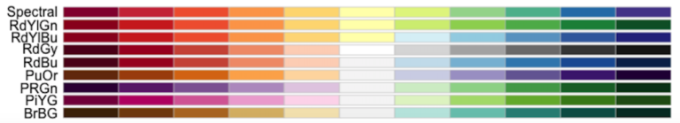
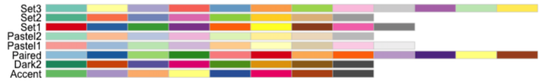
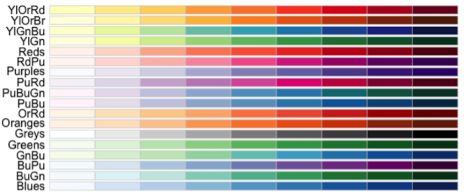
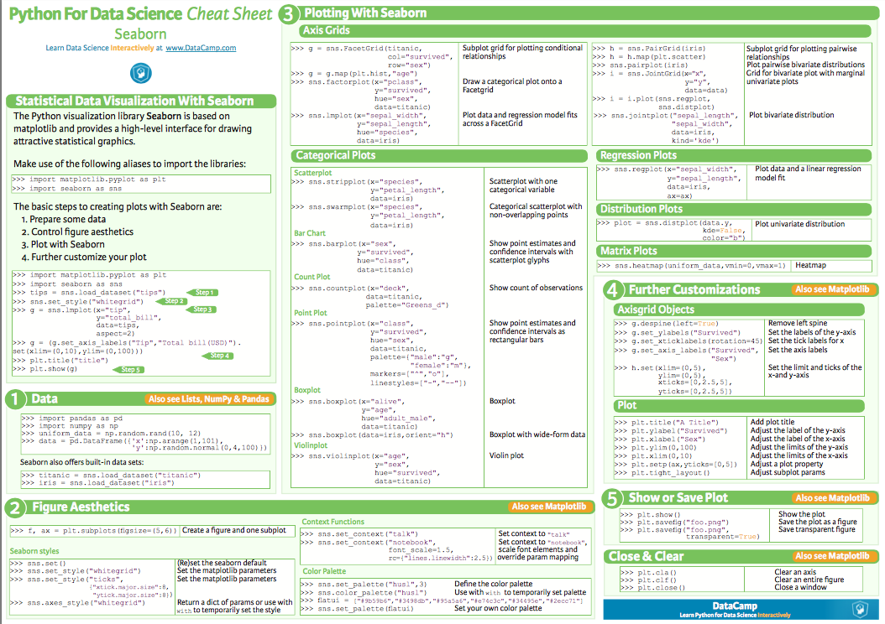
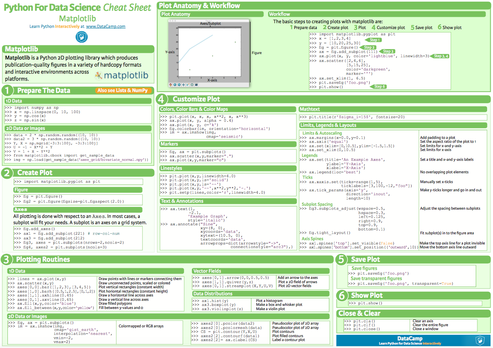
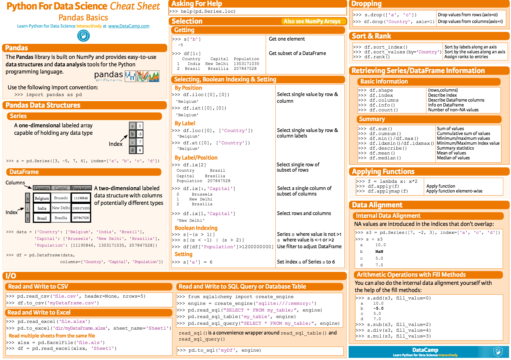
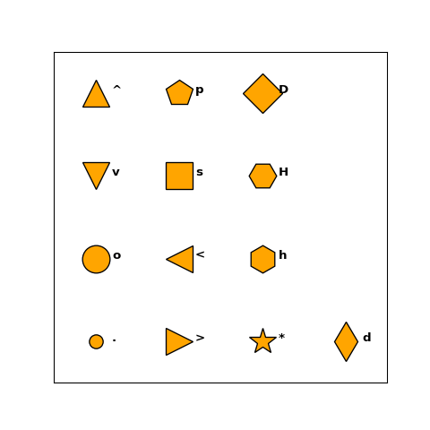

# Python plotting 

This repo presents several common python plotting functions with demos, saving people time from searching API or stackoverflow.  
There are not much instructions on each plot, just let the figures talk. 

## Categories

1. [BarPlot](BarPlot.ipynb)
2. [BoxPlot](BoxPlot.ipynb)
3. [Correlation Plot](Correlation.ipynb)
4. [Draw Image](Image.ipynb)
5. [Line/Function Plot](LinePlot.ipynb)
6. [Percentage Plot](Percentage.ipynb)
7. [Other Useful Plot](Percentage.ipynb)

## Cheatsheet ([Source](https://python-graph-gallery.com/cheat-sheets/))

- Diverging Color Palettes

- Categorical Color Palettes

- Sequential Color Palettes

- All Available Colors

- Seaborn CheatSheet

- Matplotlib CheatSheet

- Pandas CheatSheet

- Line Styles 

- All Markers

## Contact

To contact the author, please use st19930921@gmail.com
